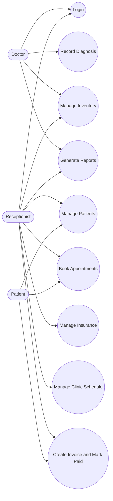
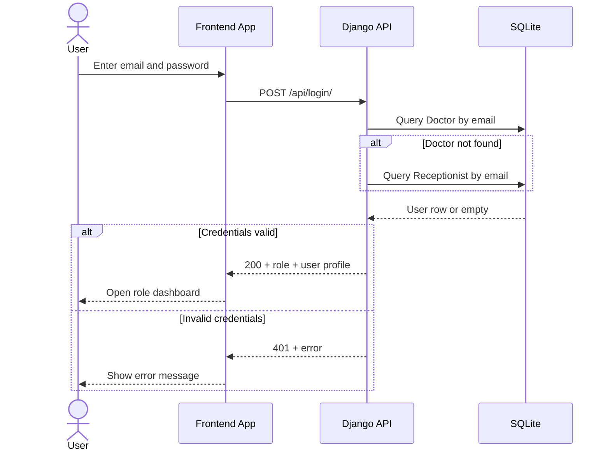
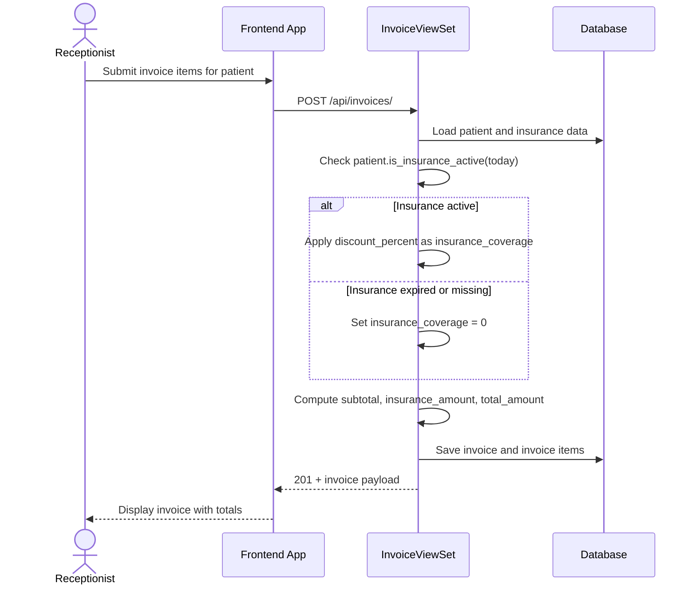
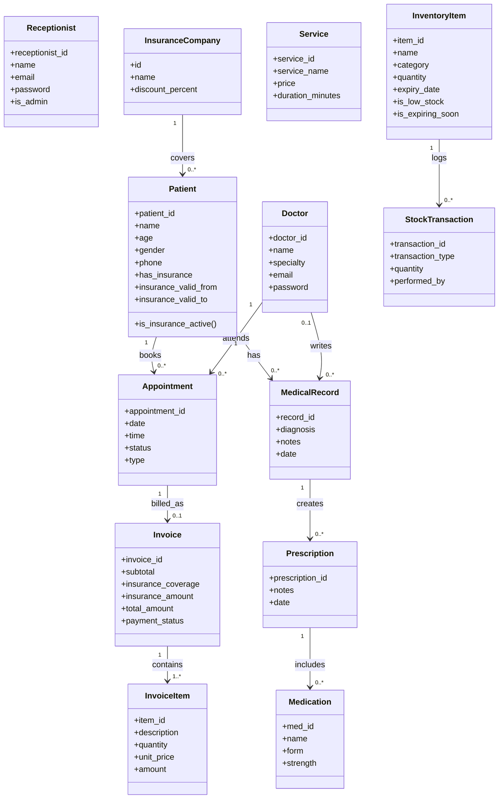
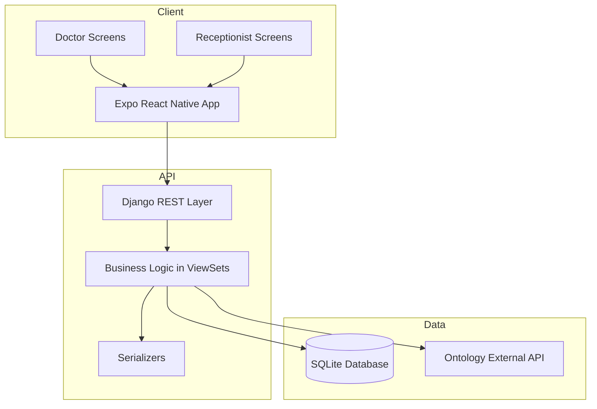
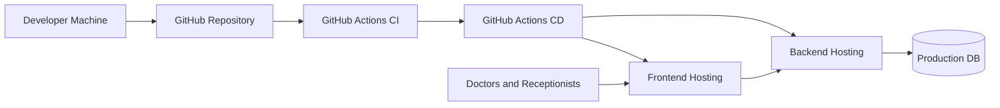
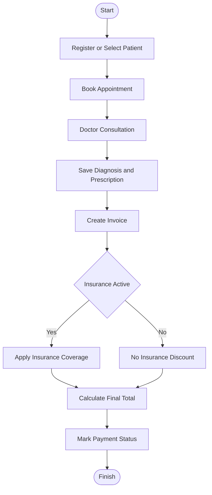
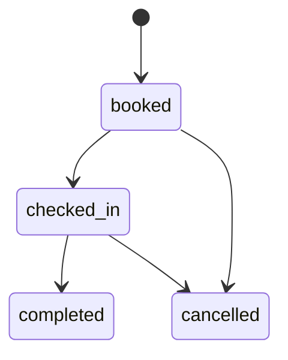

# 2. Diagrams

This section includes UML and design diagrams aligned with the implemented system.

## 2.1 Use Case Diagram

## 2.2 Sequence Diagram - Login

## 2.3 Sequence Diagram - Invoice with Insurance Rules

## 2.4 Class Diagram (Domain Model)

## 2.5 Component Diagram

## 2.6 Deployment Diagram

## 2.7 Activity Diagram - Appointment and Billing Flow

## 2.8 State Diagram - Appointment Status

